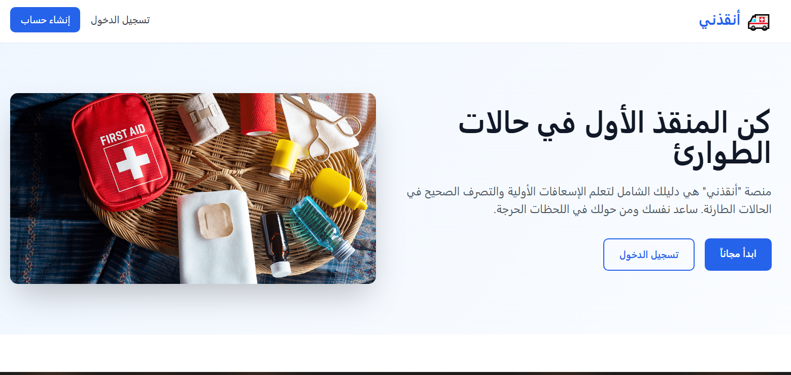
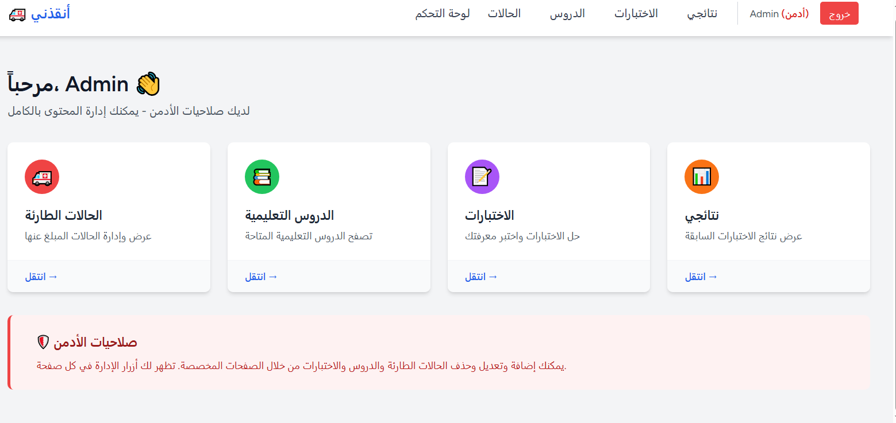
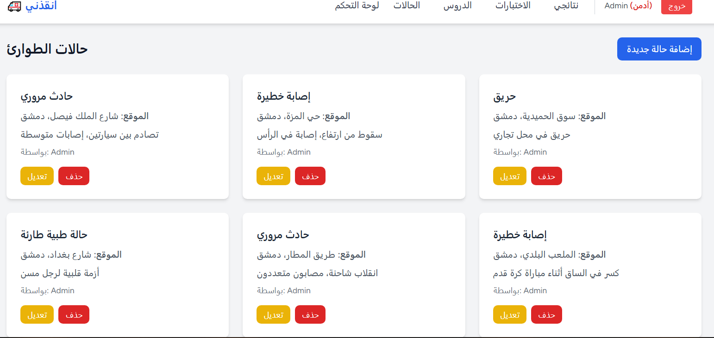
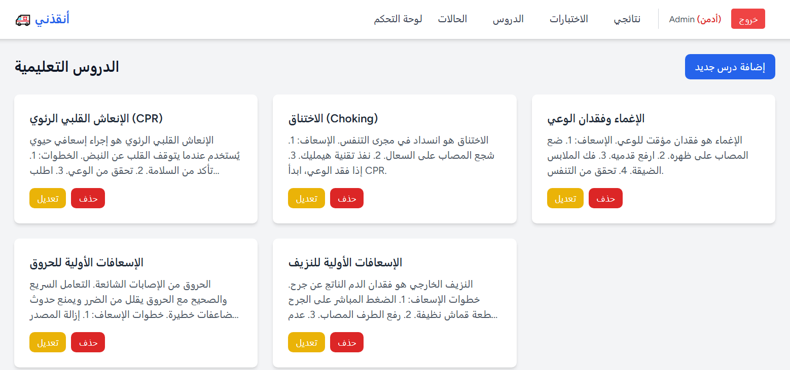
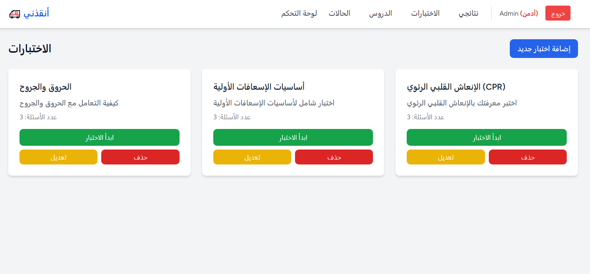
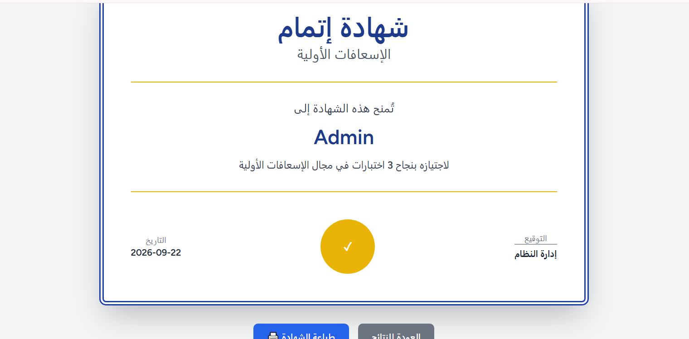
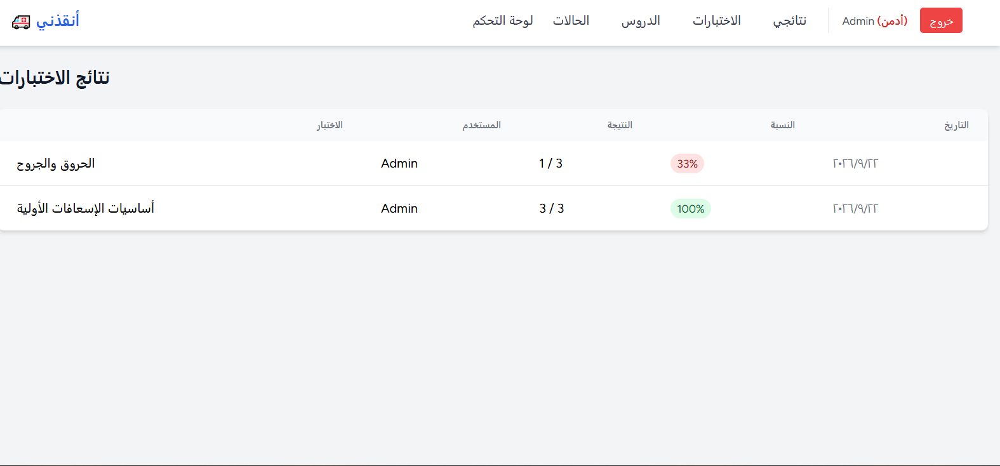

# 🚑 Emergency Guide - First Aid Platform

A full-stack web application for learning and managing first-aid procedures, built with **Laravel 11**, **React**, and **Inertia.js**.


---

## 📋 About the Project

**Emergency Guide** is a comprehensive platform that helps users learn first-aid procedures, manage emergency cases, and test their knowledge through interactive quizzes. The system includes role-based access control (Admin/User) and a certificate system for users who pass 3 or more quizzes.

This project was built from scratch using modern web technologies and demonstrates full-stack development skills, including:
- Backend API development with Laravel
- Frontend SPA with React and Inertia.js
- Database design with MySQL
- Authentication and authorization
- Responsive UI with Tailwind CSS

---

## ✨ Features

### For All Users
- 🔐 **Authentication**: Register, login, and logout with secure password hashing.
- 🚨 **Emergency Cases**: Browse different emergency scenarios (burns, bleeding, fractures, etc.).
- 📚 **Lessons**: Access educational content with videos and images.
- 📝 **Interactive Quizzes**: Take quizzes and get instant results.
- 📊 **Results**: View your quiz history.
- 🎓 **Certificate**: Earn a printable certificate after passing 3+ quizzes.

### For Admins
- 🛡️ **Role-based Access**: Admin-only features for content management.
- ➕ **CRUD Operations**: Create, read, update, and delete emergencies, lessons, and quizzes.
- 📈 **Statistics**: View all quiz results from all users.

---

## 🛠️ Technologies Used

### Backend
- **Laravel 11** - PHP framework
- **MySQL** - Database
- **Laravel Breeze** - Authentication scaffolding
- **Sanctum** - API authentication
- **Pest** - Testing framework

### Frontend
- **React 18** - UI library
- **Inertia.js** - SPA bridge between Laravel and React
- **Tailwind CSS** - Styling
- **Vite** - Build tool

---

## 🚀 Installation
## 🐳 Docker Setup

You can run this project using Docker and Docker Compose.

### Prerequisites
- Docker Desktop installed

### Steps

1. Clone the repository
   ```bash
   git clone https://github.com/RaghadAli7/emergency-guide.git
   cd emergency-guide

### Prerequisites
- PHP 8.2+
- Composer
- Node.js 18+ & npm
- MySQL

### Steps

1. **Clone the repository**
   ```bash
   git clone https://github.com/RaghadAli7/emergency-guide.git
   cd emergency-guide
   ## 📸 Screenshots

### Welcome Page


### Dashboard


### Emergency Cases


### Lessons


### Quizzes


### Certificate


### quiz-results

