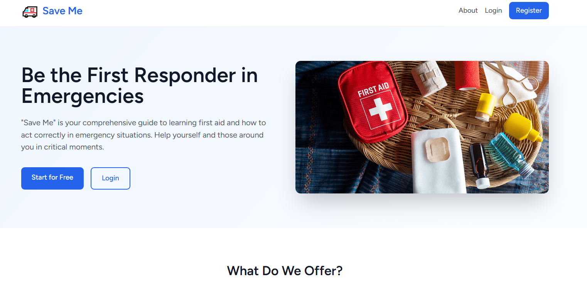
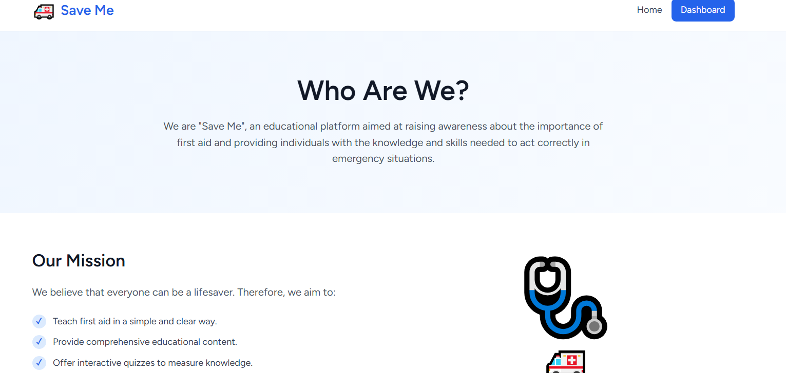
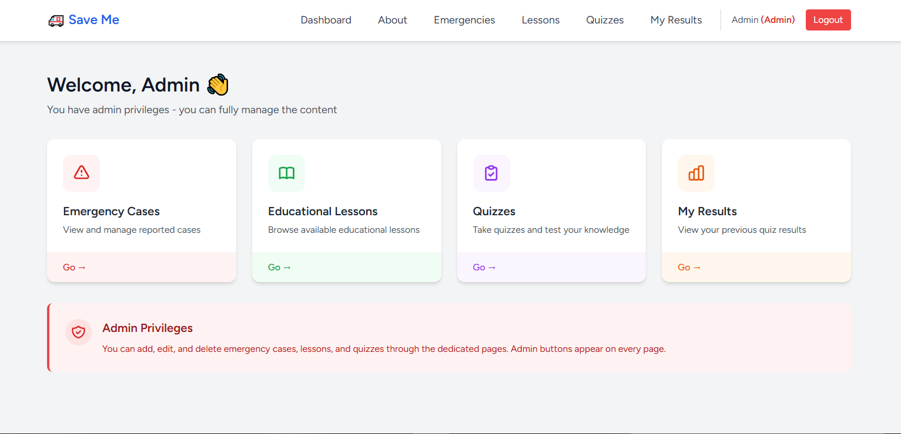
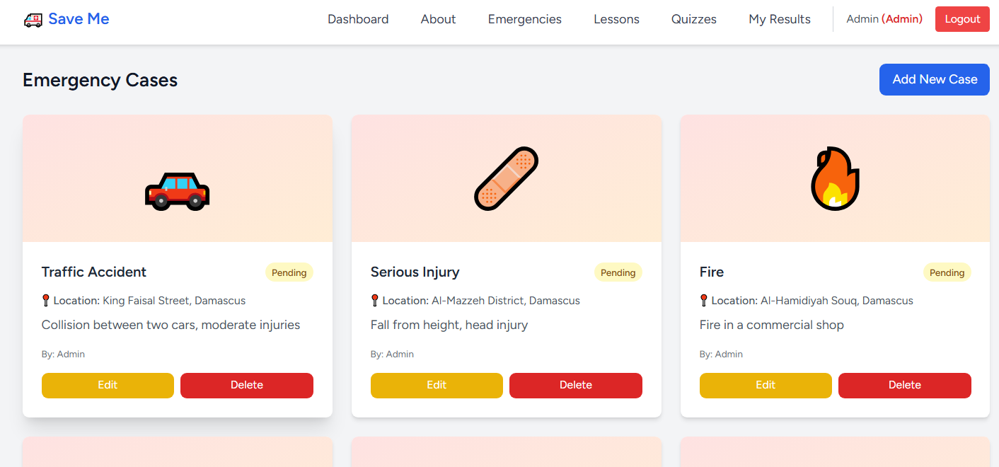
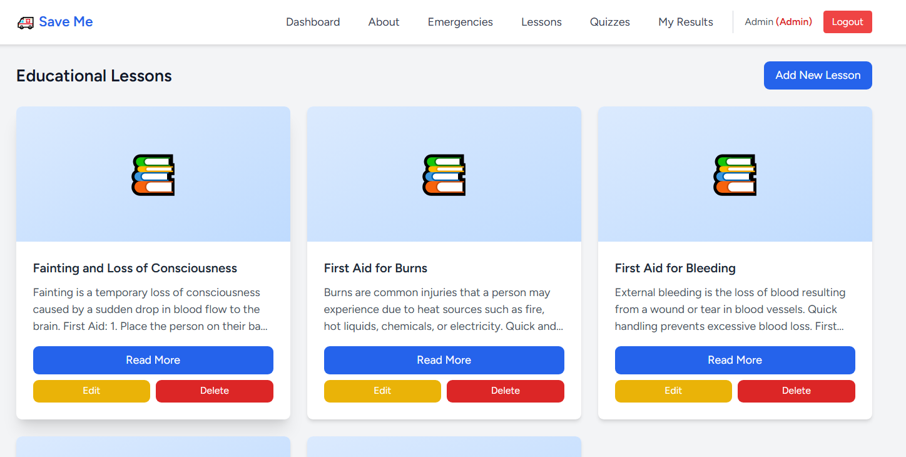
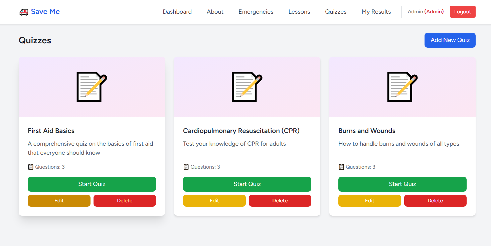
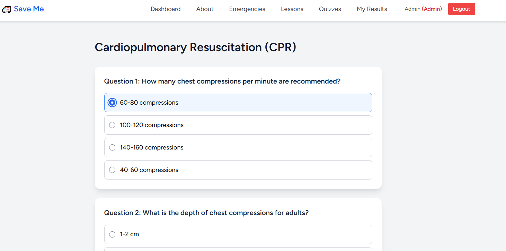
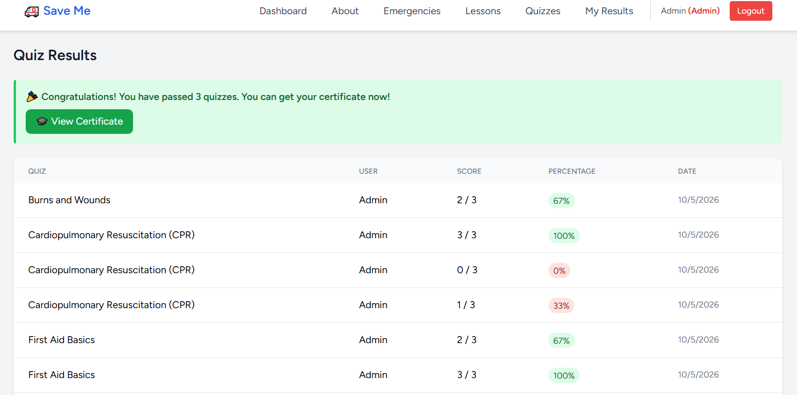
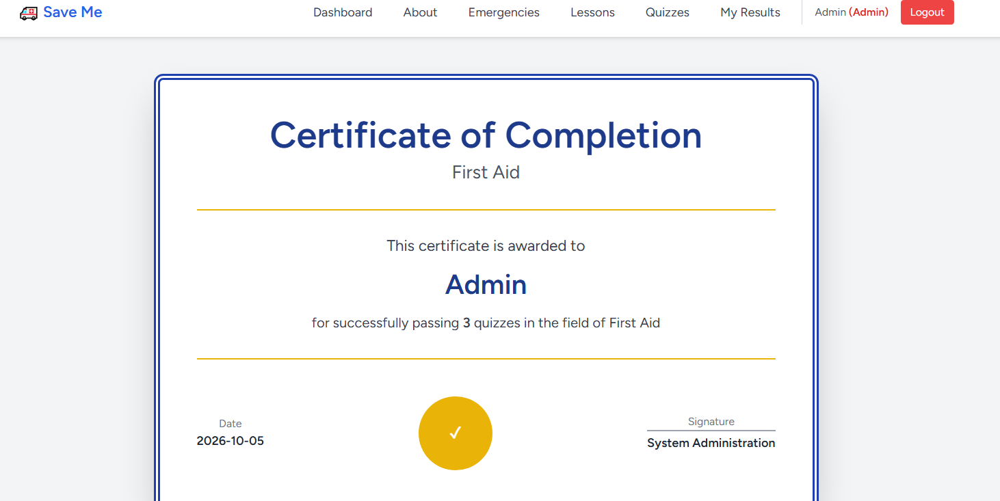

# 🚑 Emergency Guide - First Aid Platform

A full-stack web application for learning and managing first-aid procedures, built with **Laravel 11**, **React**, and **Inertia.js**.

## 📋 About the Project

**Emergency Guide** (Save Me) is a comprehensive platform that helps users learn first-aid procedures, manage emergency cases, and test their knowledge through interactive quizzes. The system includes role-based access control (Admin/User) and a certificate system for users who pass 3 or more quizzes.

This project was built from scratch using modern web technologies and demonstrates full-stack development skills, including:

- Backend API development with Laravel
- Frontend SPA with React and Inertia.js
- Database design with MySQL
- Authentication and authorization
- Responsive UI with Tailwind CSS

## ✨ Features

### For All Users

- 🔐 **Authentication** — Register, login, and logout with secure password hashing.
- 🚨 **Emergency Cases** — Browse different emergency scenarios (burns, bleeding, fractures, etc.).
- 📚 **Lessons** — Access educational content with videos and images.
- 📝 **Interactive Quizzes** — Take quizzes and get instant results.
- 📊 **Results** — View your quiz history.
- 🎓 **Certificate** — Earn a printable certificate after passing 3+ quizzes.

### For Admins

- 🛡️ **Role-based Access** — Admin-only features for content management.
- ➕ **CRUD Operations** — Create, read, update, and delete emergencies, lessons, and quizzes.
- 📈 **Statistics** — View all quiz results from all users.

## 🛠 Technologies Used

### Backend

- **Laravel 11** — PHP framework
- **MySQL** — Database
- **Laravel Breeze** — Authentication scaffolding
- **Sanctum** — API authentication
- **Pest** — Testing framework

### Frontend

- **React 18** — UI library
- **Inertia.js** — SPA bridge between Laravel and React
- **Tailwind CSS** — Styling
- **Vite** — Build tool
## 🚀 Installation

### Prerequisites

- PHP 8.2+
- Composer
- Node.js 18+ & npm
- MySQL

### Steps

**1. Clone the repository**

    git clone https://github.com/RaghadAli7/emergency-guide.git
    cd emergency-guide

**2. Install PHP dependencies**

    composer install

**3. Install Node dependencies**

    npm install

**4. Configure environment**

    cp .env.example .env
    php artisan key:generate

Edit `.env` and set your database credentials:

    DB_CONNECTION=mysql
    DB_HOST=127.0.0.1
    DB_PORT=3306
    DB_DATABASE=emergency_guide
    DB_USERNAME=root
    DB_PASSWORD=

**5. Create database**

Create a MySQL database named `emergency_guide` (via phpMyAdmin or CLI).

**6. Run migrations**

    php artisan migrate

**7. Start the development servers**

Terminal 1 — Vite:

    npm run dev

Terminal 2 — Laravel:

    php artisan serve

**8. Open in browser**

    http://127.0.0.1:8000

Register a new account and start exploring! 🎉

## 🐳 Docker Setup

You can also run this project using Docker and Docker Compose.

### Prerequisites

- Docker Desktop installed

### Steps

**1. Clone the repository**

    git clone https://github.com/RaghadAli7/emergency-guide.git
    cd emergency-guide

**2. Build and start containers**

    docker-compose up -d --build

**3. Run migrations inside the container**

    docker-compose exec app php artisan migrate

**4. Open in browser**

    http://localhost:8000

**5. Stop containers**

    docker-compose down

   
 ## 📸 Screenshots
### Welcome Page

### About Page

### Dashboard

### Emergency Cases

### Educational Lessons

### Quizzes

### Quiz Taking

### Quiz Results

### Certificate

## 👤 Author

**Raghad Ali**

- GitHub: [@RaghadAli7](https://github.com/RaghadAli7)
- Email: raghad77aliali@gmail.com

## 📄 License

This project is open-source and available under the [MIT License](LICENSE).

## 🙏 Acknowledgments

- Laravel Community
- Inertia.js Team
- Tailwind CSS Team
- React Team
